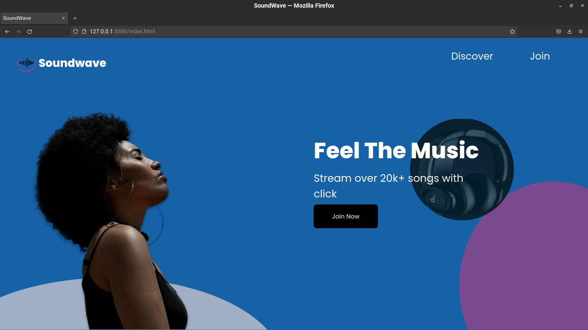
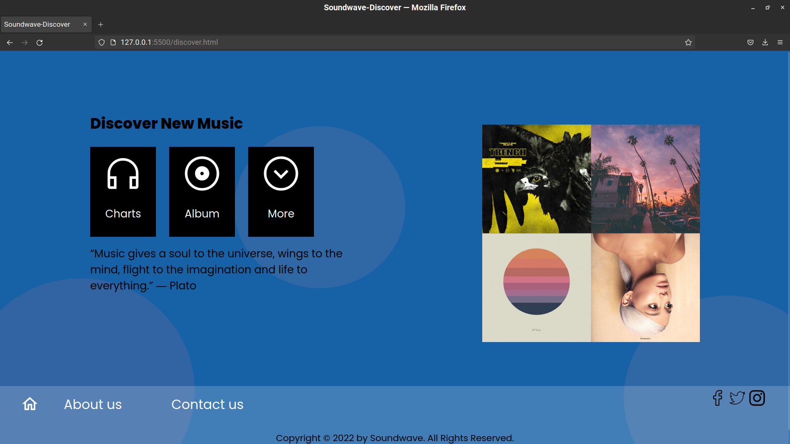
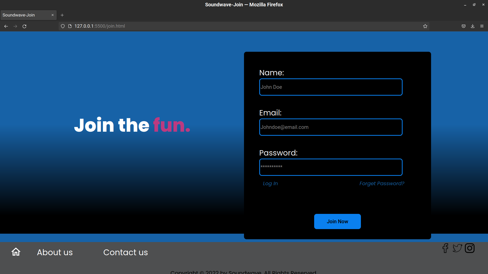

# Soundwave UI Redesign

This is a multiple screen redesign for Soundwave. UI design was done by [Godfrey Agbi](https://www.twitter.com/by.agbi) and developed by [Philip Nnaa](https://www.github.com/CODEmator).

## Tech Stack

**Client:** Javascript, Html, Scss

**Server:** Python, Flask

## Screenshots

## Authors

- [Philip Nnaa](https://www.github.com/CODEmator)
- [Godfrey Agbi](https://www.twitter.com/by.agbi)

## Feedback

If you have any feedback, please reach out to us at codematorng@gmail.com